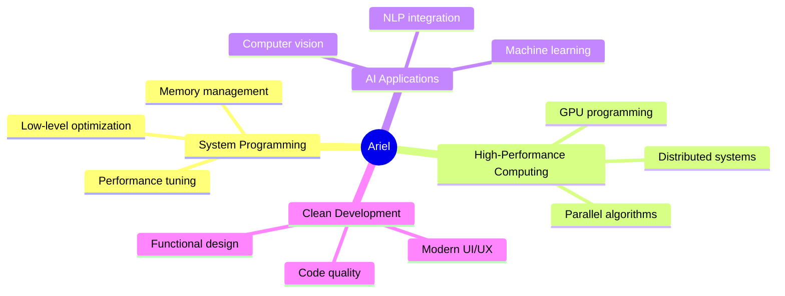

<div align="center">
  
# 👋 Hi there, I'm Ariel Blinder


</div>

---

## 🧠 About Me


```typescript
const ariel = {
    education: "BSc Computer Science @ Afeka College (Aug 2025)",
    passion: ["Problem Solving", "Algorithm Design", "Clean Code"],
    expertise: ["Systems Programming", "Machine Learning", "Parallel Computing"],
    currentFocus: "Building efficient, impactful software",
    seeking: "Junior Software Developer roles",
    motto: "Deep dive into complex challenges 🚀"
};
```

<br clear="both"/>

---

## 💻 Tech Stack

<div align="center">

### Programming Languages
[](https://en.wikipedia.org/wiki/C_(programming_language))
[](https://en.wikipedia.org/wiki/C%2B%2B)
[](https://www.java.com)
[](https://www.python.org)
[](https://developer.mozilla.org/en-US/docs/Web/JavaScript)

### Frameworks & Libraries
[](https://reactjs.org/)
[](https://flask.palletsprojects.com/)
[](https://opencv.org/)

### Tools & Technologies
[](https://git-scm.com/)
[](https://www.linux.org/)
[](https://developer.nvidia.com/cuda-zone)
[](https://www.w3schools.com/sql/)

</div>

---

## 🛠️ Development Environment

<div align="center">

[](https://code.visualstudio.com/)
[](https://www.jetbrains.com/clion/)
[](https://www.jetbrains.com/idea/)
[](https://www.jetbrains.com/pycharm/)
[](https://cursor.sh/)

</div>

---

## 📚 Featured Projects

<div align="center">

<table>
<tr>
<td width="50%">

### 🎯 BoardCast – Real-Time Whiteboard Transcription
**React + ML**
- 🔍 Converts whiteboard content to digital text using OCR (LLaMA 4)
- 📹 Video analysis with Gemini 2.0
- 🚀 Live feed processing & document export
- 🎨 Modern UI with Flask backend

</td>
<td width="50%">

### ⚡ Parallel Image Processing
**OpenMP & CUDA**
- 🏎️ Accelerated matrix filters and convolution
- 🔧 GPU-based pipeline with CPU fallback
- 📊 Real-time performance benchmarks
- 🎯 Optimized parallel computing

</td>
</tr>
<tr>
<td width="50%">

### 🎓 Exam Management System
**Java**
- 📝 Object-oriented desktop application
- 💾 Robust file handling system
- 🏗️ Modular architecture design
- 🎯 Complete exam lifecycle management

</td>
<td width="50%">

### 🛒 Shopping Cart & Database
**SQL + Java**
- 🗄️ Full ERD modeling & normalized schema
- 🔧 Backend logic with transaction management
- 📦 Item flow optimization
- 🔐 Secure database integration

</td>
</tr>
</table>

### 🔒 Data Security Algorithms
**C + Number Theory**
- 🔑 Cryptographic number theory tools
- ✅ Prime checks & Carmichael number detection
- 🌊 Primitive root calculation
- ⚙️ Modular builds with robust CLI

</div>

---

## 🔥 What Drives Me

<div align="center">



</div>

---

## 📊 GitHub Stats

<div align="center">


</div>

---

## 🤝 Let's Connect!

<div align="center">

[](https://www.linkedin.com/in/ariel-blinder)
[](https://github.com/arielblinder)
[](mailto:arielxblinder@gmail.com)

---


**⭐ From [arielblinder](https://github.com/arielblinder)**

</div>
